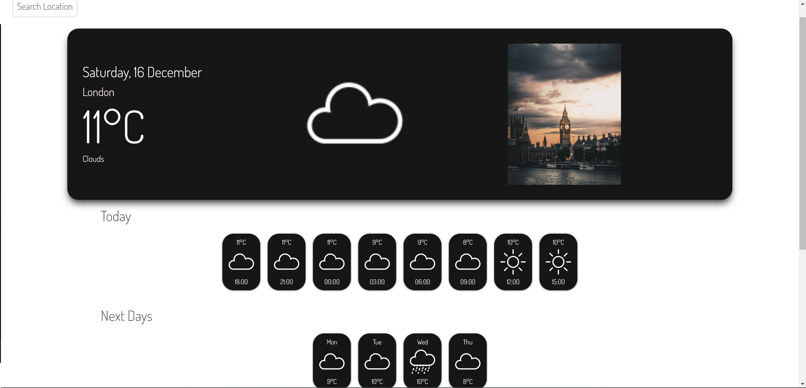

# Weather App

You have been sent abroad for a 10-month work mission. Your family and friends back home ask you about the weather where you live ALL. THE. TIME.
Enough is enough, you decide to build a small web application for them so that you can free your time to talk about more interesting topics.

## Screenshots

## Badges

## work progress

This project was made in October 2023 during a formation at BeCode. 

